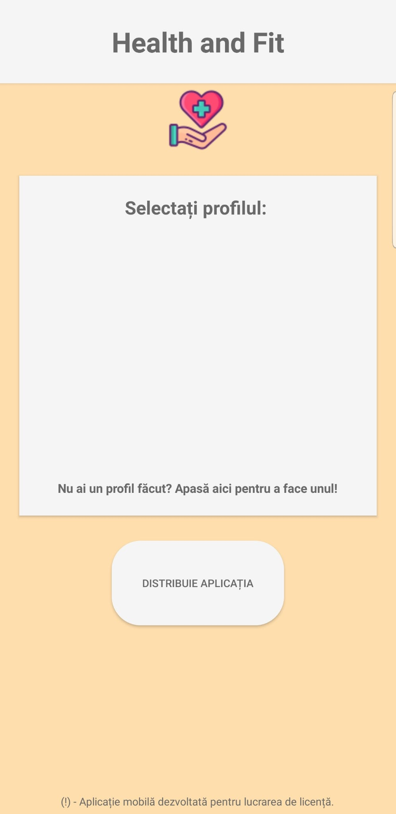
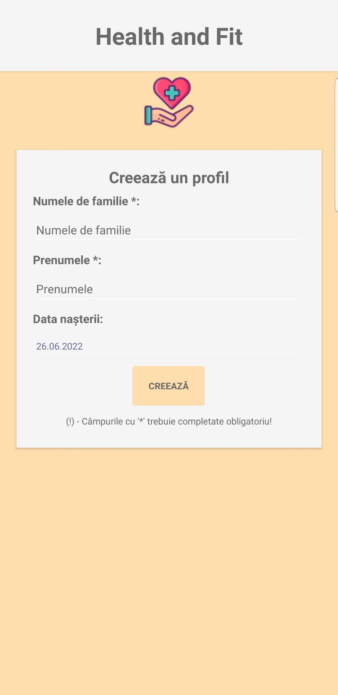
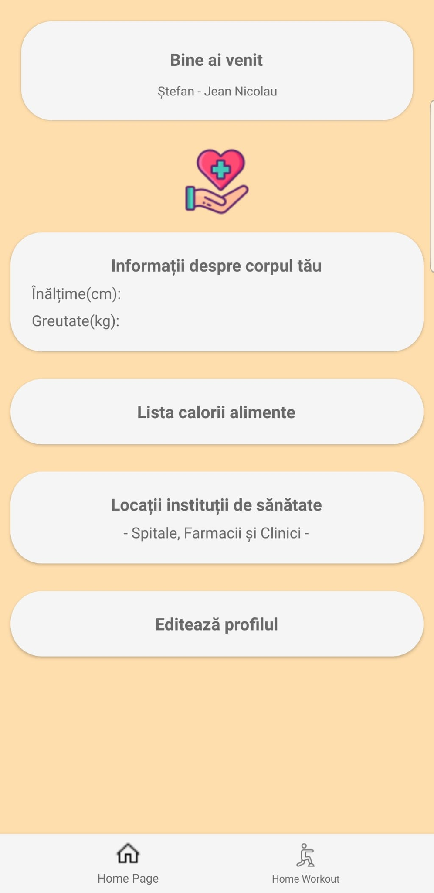
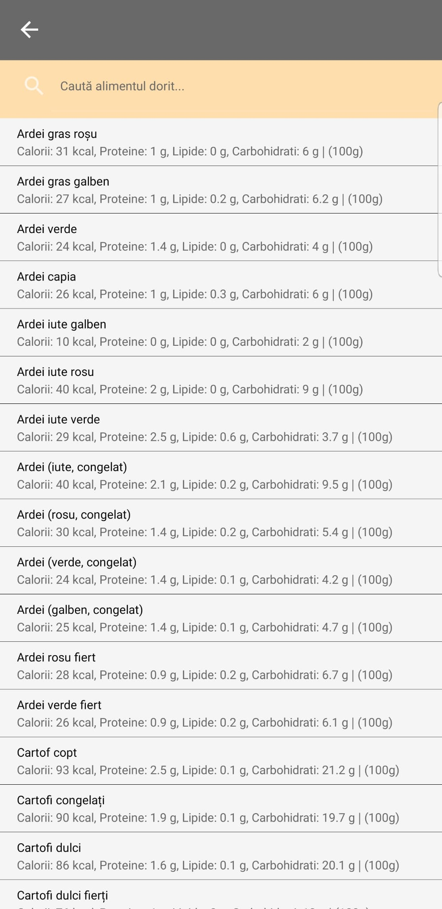
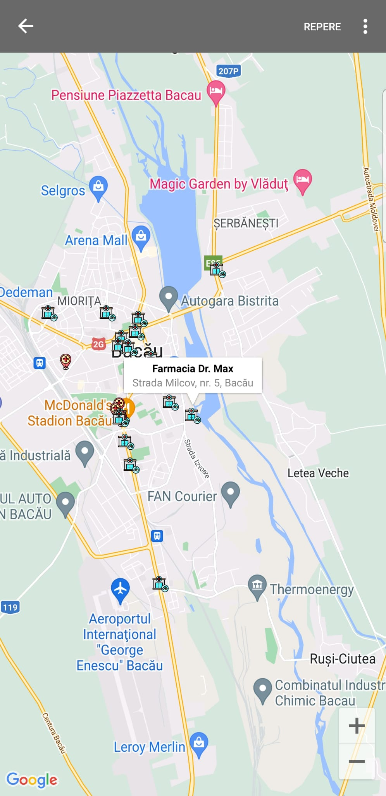
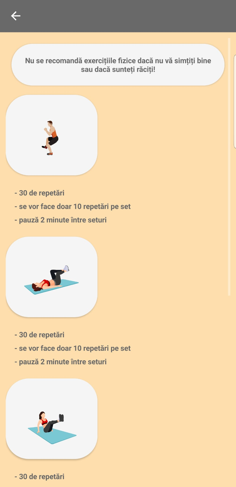

# Mobile-Application-Xamarin-HealthFit-
The application (Android) allows the user to store information about his body (height, weight), also provides information about the characteristics of vegetables (calories per x grams), the exact locations of certain health institutions in the city of Bacău and a small home workout for 7 days.

I used Xamarin to create the application and for the rest of the functions i used Xamarin Google Maps & API Map (location health institutions and map rendering) , Android Lottie (the animations from the workout plan).

Screenshots:
 

